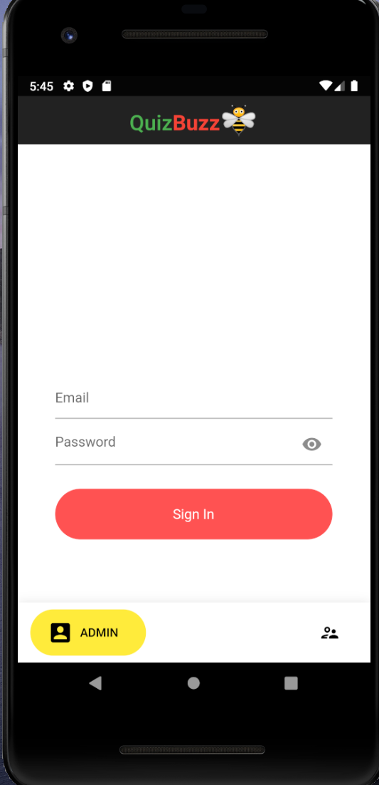
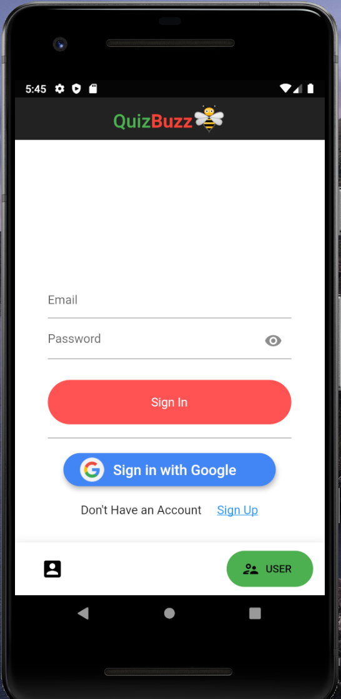
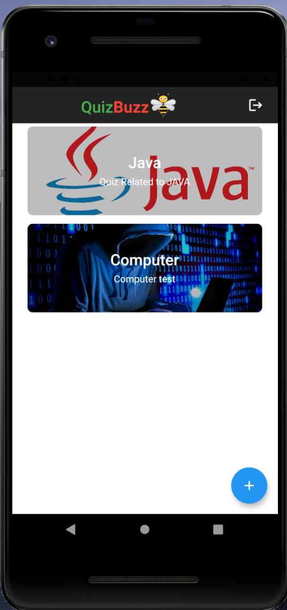
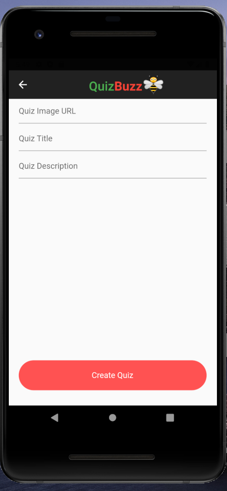
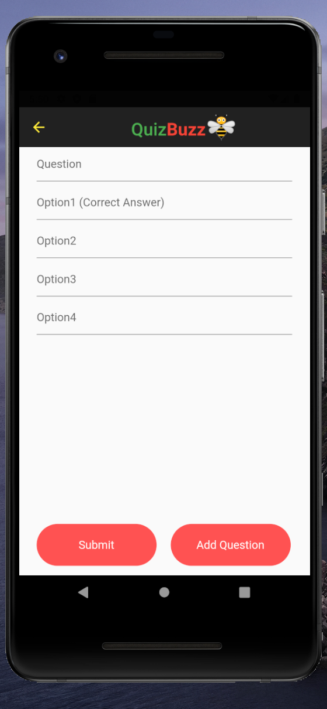
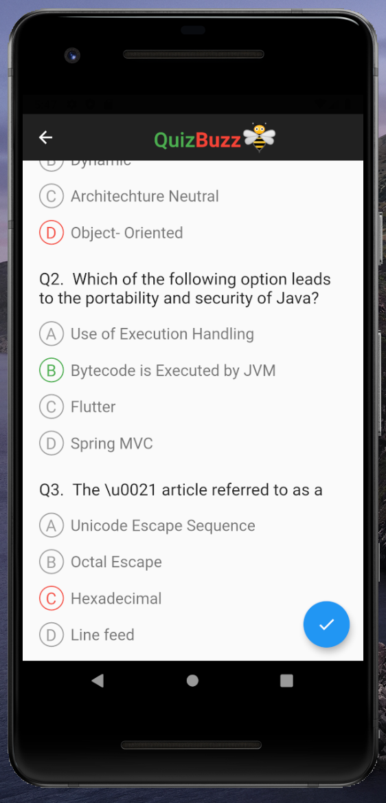
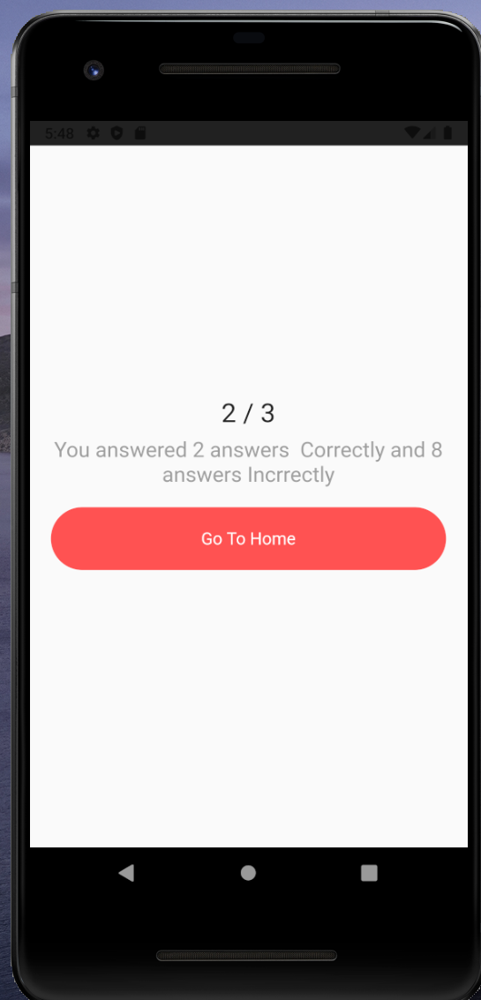

# Quiz-App

A Mobile Application where the admin can upload questions and can provide pictorial representation too and the required students/candidates can give their test.
Although the topics can be changed by changing the Firestore data for really any other types of quiz.
Going with Flutter is a easy choice with its quick development time and fast execution times.
Firebase as the backend and storage solution makes it very easy to scale and change all the quiz subjects.
The biggest challenge was getting the Oauth to work in Google services and Firebase login.

# App Screen

Home Screen


1.Quiz Page / Questions page

2.Results page with Chart

3.Detailed Report for Quiz took

4.Admin Panel Screen

# User Authentication / Admin login & Register
1. 


# Supported Platforms

* Android


## Getting Started

This project is a starting point for a Flutter application.
Clone this repository, with VSCode or Android Studio then download the Flutter tools. Note you will need to provide your own generated GCP or AWS keys for the services listed in `ios/Runner/GoogleService-Info.plist`
```aidl
$ git clone
$ cd QuizBuzz
$ flutter run
```

## Built With
* [Flutter](https://flutter.dev/) - The hybrid framework used.
* [Dart](https://dart.dev/) - The language Flutter is written in.
* [Firebase](https://firebase.google.com) - Cloud NoSQL database


For help getting started with Flutter, view our
[online documentation](https://flutter.dev/docs), which offers tutorials,

## Screenshots
                                      